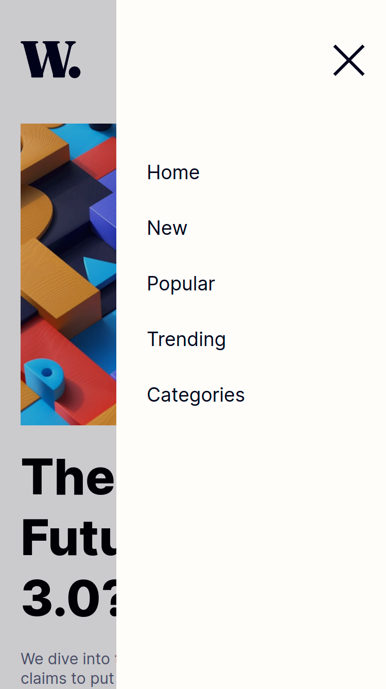

# Frontend Mentor - News homepage solution

This is a solution to the [News homepage challenge on Frontend Mentor](https://www.frontendmentor.io/challenges/news-homepage-H6SWTa1MFl). Frontend Mentor challenges help you improve your coding skills by building realistic projects. 

## Table of contents

- [Overview](#overview)
  - [The challenge](#the-challenge)
  - [Screenshot](#screenshot)
  - [Links](#links)
- [My process](#my-process)
  - [Built with](#built-with)
  - [What I learned](#what-i-learned)
  - [Continued development](#continued-development)
  - [Useful resources](#useful-resources)
- [Author](#author)

## Overview

### The challenge

Users should be able to:

- View the optimal layout for the interface depending on their device's screen size
- See hover and focus states for all interactive elements on the page

### Screenshot

### Links

- Solution URL: [GitHub](https://github.com/orlowski-dev/fm-news-homepage)
- Live Site URL: [GitHub Pages](https://orlowski-dev.github.io/fm-news-homepage/)

## My process

### Built with

- Semantic HTML5 markup
- CSS custom properties
- Flexbox
- CSS Grid
- Mobile-first workflow
- jQuery

### What I learned
I learned how to:
- make sliding mobile navigation menu
- specifies a grid item's size and location using `grid-column`

### Continued development

- JavaScript!!
- jQuery
- CSS Grid
- ARIA

### Useful resources

- [UX for navigation](https://uxdesign.cc/accessibility-of-the-navigation-menu-8a915e4d3e51) - Accessibility of the navigation menu of web application
- [ARIA APG](https://www.w3.org/WAI/ARIA/apg/patterns/menu-button/examples/menu-button-links/) - Navigation Menu Button Example
- [MDN](https://developer.mozilla.org/en-US/docs/Web/CSS/grid-column) - grid-column

## Author

- Website - [@orlowski-dev](https://www.frontendmentor.io/profile/orlowski-dev)
